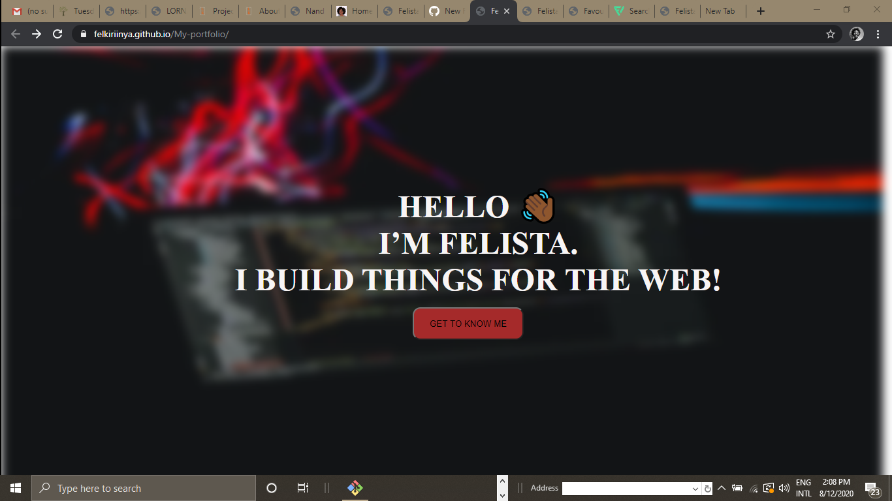
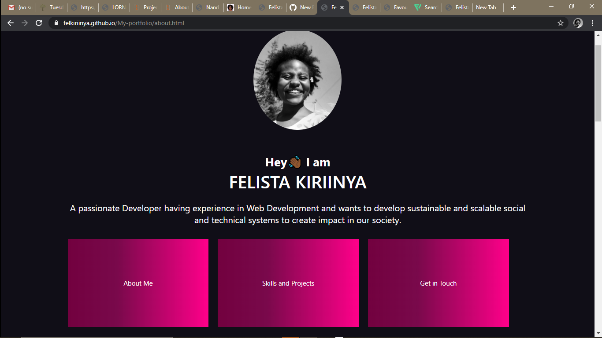
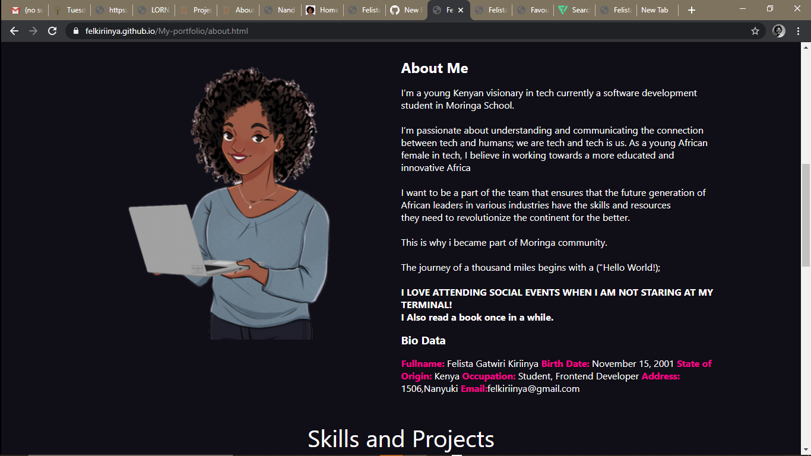
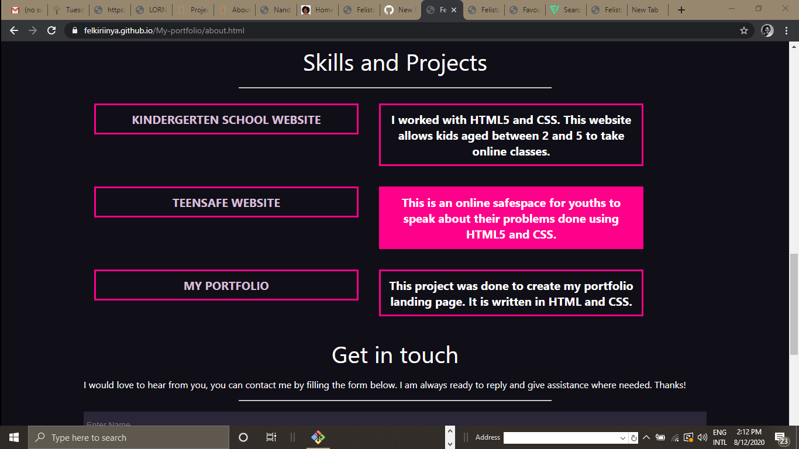
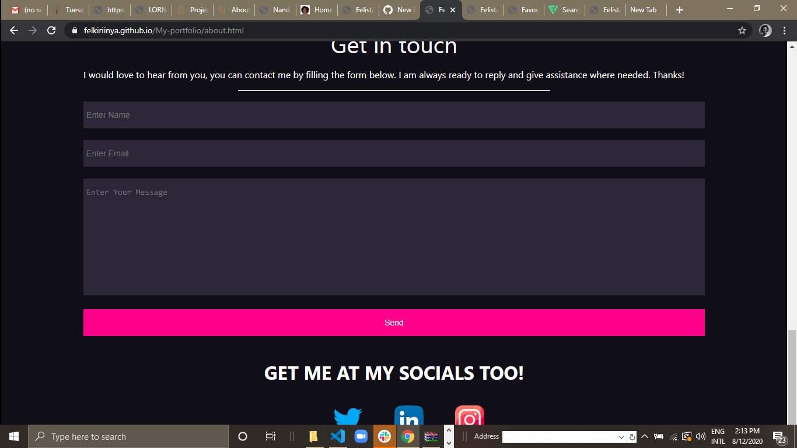

# My Portfolio
#### An online portfolio for Felista Kiriinya, 12th August 2020
#### By Felista Kiriinya
## Description
This is an online portfolio for Felista Kiriinya. This webpage provides visitors with insight into who Felista Kiriinya is as a developer, her interests, hobbies, skills, educational and professional background and most importantly access to projects she's done. The webpage's landing page has a "Get To Know Me" button as shown below that leads you to the about and projects page.
Once you open my portfolio this is what you see first

The get to know me button opens up to:

## Setup/Installation Requirements
To view My Portfolio, do the following;
1. Check that your internet connection is active.
2. Click on this link https://felkiriinya.github.io/My-portfolio/about.html. Doing so will redirect you to my portfolio's landing page.
## Technologies Used
This project is written in HTML and CSS.
## Support and contact details
Should you be unable to access my portfolio, have any recommendations or questions, feel free to email me; felkiriinya@gmail.com.
### License
*MIT
Copyright (c) 2020 **Felista Kiriinya**
